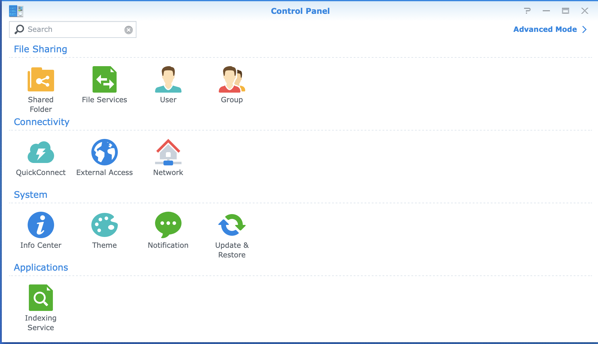
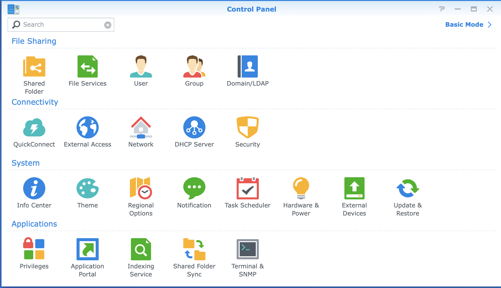
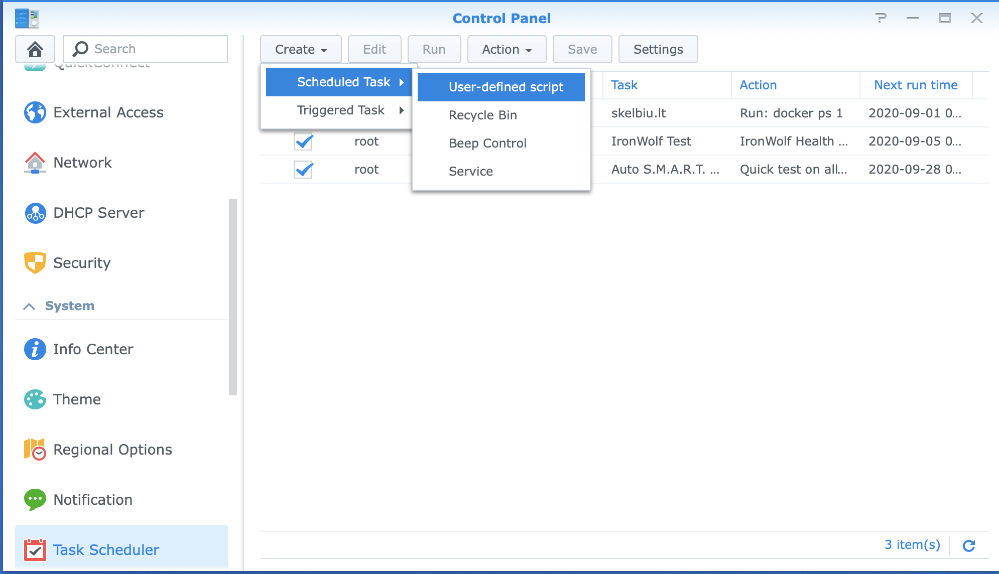
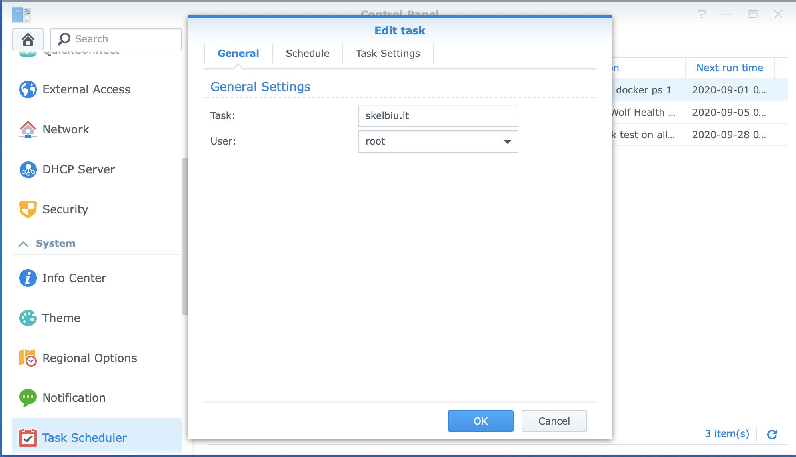
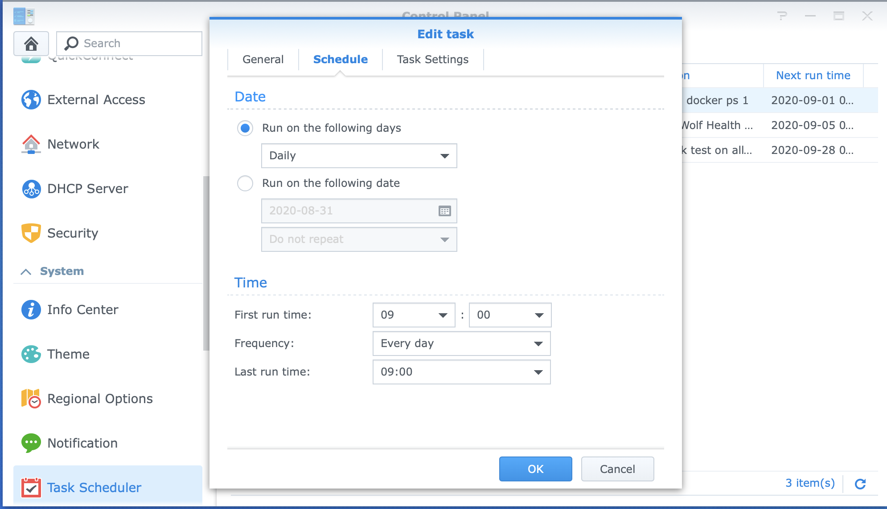
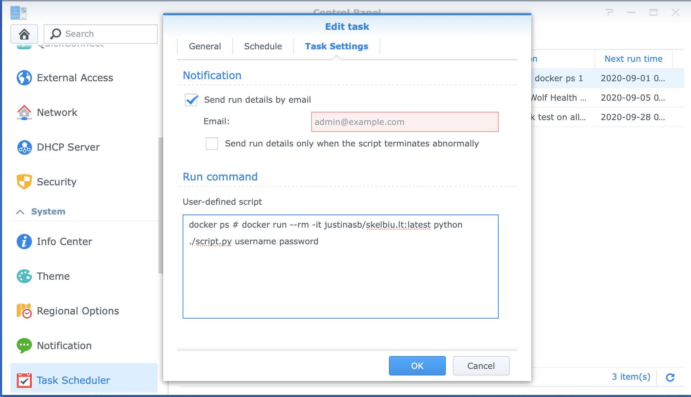

# To run on Synology NAS on schedule

1. Open control panel

1. Switch to `Advanced Mode`

1. Create new scheduled task

1. Set task name and user

1. Set schedule

1. Set command to `docker run --rm -i justinasb/skelbiu.lt:latest python ./script.py $USERNAME $PASSWORD` in `Task Settings` by replacing `$USERNAME` and `$PASSWORD` with actual values


# To run this on demand

```
docker build -t justinasb/skelbiu.lt:latest .
docker run --rm -it justinasb/skelbiu.lt:latest
docker run justinasb/skelbiu.lt:latest python ./script.py $USERNAME $PASSWORD
```
